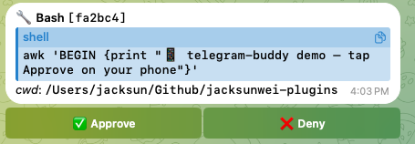
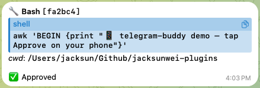
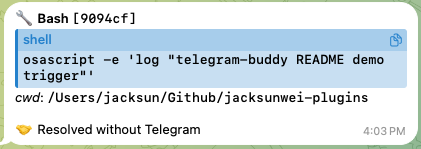

# telegram-buddy

**Step away from the terminal. Tap Approve on your phone. Claude keeps going.**

A Claude Code plugin that diverts permission prompts to a Telegram chat. When Claude hits a `git push`, an unfamiliar
`rm`, or any other prompt-worthy call, your phone buzzes — one tap and the run resumes from wherever you are. Calls
already in your `permissions.allow` keep running silently; only the things that would actually stall Claude reach your
phone.



## When you'd want this

**Step away mid-task.** The dishwasher's beeping, the kid needs pickup, the coffee run can't wait — and Claude is
halfway through a long refactor. Flip on Telegram approvals, walk out the door. When Claude hits the next `git push` or
`rm`, your phone buzzes; tap **Approve** from the sidewalk and the run keeps moving instead of stalling on an empty
terminal until you're back.

**Read without breaking flow.** Claude is mid-stream printing a wall of analysis you actually want to absorb. The moment
it hits a permission prompt, the terminal yanks your focus into a modal and your reading flow shatters. With Telegram
on, the prompt diverts to your phone — thumb-tap **Approve**, eyes never leave the scrollback.

## The daily loop

Two commands. That's the whole UX.

```
/telegram-buddy:on    # before you step away
/telegram-buddy:off   # when you're back
```

Plain language works too: *"Enable Telegram approvals"* / *"Disable Telegram approvals"*. Check current state with
`/telegram-buddy:status`.

## What it looks like

The three states a permission request goes through on Telegram:

**1. Prompt arrives.** Inline-keyboard buttons attached to the request:


**2. You tap Approve.** Buttons disappear, the bubble shows ✅ Approved (or ❌ Denied), and Claude continues:



**3. You answered locally instead.** The local terminal prompt fires in parallel; if you answer there first, Claude runs
the tool and the Telegram bubble auto-clears to 🤝 Resolved without Telegram so you know the message is stale:



## Why this and not the official `telegram` plugin

**Works on any backend.** The official plugin's `claude/channel/permission` capability (and Claude Code's `auto` mode)
require the direct Anthropic API — on Vertex AI / Bedrock / Foundry / 3rd-party models, Claude Code drops them silently.
telegram-buddy uses a `PermissionRequest` HTTP hook instead, so it works regardless of which backend you've configured.

**Different session shape.** The official plugin extends the whole session to Telegram — input, output, and approvals
all reachable from the phone in parallel with the terminal. telegram-buddy mirrors only the permission modal; your
scrollback and editor stay the sole I/O surface, and your phone stays quiet except when Claude actually needs you.

## Setup

### 1. Create a Telegram bot

Message [@BotFather](https://t.me/BotFather) → `/newbot` → follow the prompts → save the HTTP API token.

### 2. Install the plugin

From the [`jacksunwei-plugins`](../..) marketplace:

```bash
/plugin marketplace add jacksunwei/jacksunwei-plugins
/plugin install telegram-buddy@jacksunwei-plugins
```

Claude Code prompts for two values during install:

- **Telegram Bot Token** — paste the token from BotFather. Stored in your macOS Keychain (or
  `~/.claude/.credentials.json` on Linux/Windows); never written to disk in plain text.
- **Telegram Chat ID** — your numeric Telegram user ID. Get it by messaging [@userinfobot](https://t.me/userinfobot) —
  copy the `Id` value it returns.

Reconfigure later: `/plugin list` → telegram-buddy → Configure options.

> Heads-up: Claude Code v2.1.84 has a known bug where the install prompts can be skipped. If you don't see them, use the
> `Configure options` flow above to set the values.

### 3. Open the bot's chat

DM your bot once (any message) — Telegram requires you to initiate before a bot can message you back.

## Tool reference

| Slash command            | MCP tool           | What it does                                                                                                 |
| ------------------------ | ------------------ | ------------------------------------------------------------------------------------------------------------ |
| `/telegram-buddy:on`     | `enable_telegram`  | Bind `127.0.0.1:52891`, start the Telegram poller. Sends to the chat ID from your install/Configure options. |
| `/telegram-buddy:off`    | `disable_telegram` | Stop the listener and poller. Future prompts go back to the terminal.                                        |
| `/telegram-buddy:status` | `status`           | Show enabled/polling state, current owner of the bridge, pending and decided counters.                       |

Tip: add the three MCP names (`mcp__plugin_telegram-buddy_telegram-buddy__*`) to `permissions.allow` in
`~/.claude/settings.json` so the slash commands don't themselves trigger a prompt.

## How it works

1. **Permission-only hook.** A `PermissionRequest` HTTP hook (declared in `plugin.json`) fires *only* when Claude Code
   is about to prompt you — calls covered by `permissions.allow` are auto-approved upstream and never reach the bridge.
1. **On-demand listener.** The MCP server only binds port 52891 when you call `enable_telegram`. Disabled = port unbound
   = hook gets connection-refused = silent local-prompt fallback.
1. **Telegram round-trip.** While enabled, the server forwards each prompt as an inline-keyboard message to your chat;
   the button callback resolves the pending request and the hook returns the decision to Claude Code.
1. **Multi-session safe.** Hooks fire from every Claude Code session on the machine, but the bridge filters by
   `session_id` — only the session that called `/telegram-buddy:on` (the *owner*) gets routed to Telegram. Other
   sessions silently fall back to local prompts. Calling `/telegram-buddy:on` from a second session triggers an
   automatic handover via the bridge's `/release` endpoint.

## Configuration

Bot token and chat ID are set via the install prompts (above). Reconfigure later: `/plugin list` → telegram-buddy →
Configure options.

For standalone testing outside Claude Code, the server honors these env vars as fallbacks:

| Variable                 | Notes                                                       |
| ------------------------ | ----------------------------------------------------------- |
| `TELEGRAM_BOT_TOKEN`     | Bot token.                                                  |
| `TELEGRAM_BUDDY_CHAT_ID` | Chat ID for `enable_telegram` to send approval messages to. |

## Edge cases & limitations

- **Approval timeout** (no tap within 8h) → hook returns no decision, Claude falls back to the local prompt. The
  originating session is blocked the whole time.
- **Take-over transition.** When another session calls `/telegram-buddy:on` while you hold the bridge, ownership
  transfers cleanly via `/release`. Polling can sit in `starting` for up to ~30s afterward while the previous owner's
  long-poll drains — `status()` shows the live state. Sends work during this window; tap callbacks queue at Telegram
  until polling becomes `active`.
- **Forgot to disable before closing Claude Code.** The MCP server is killed on exit, the port frees automatically, but
  any in-flight Telegram messages with active buttons become dead-ends until something else (a new owner, a future tap)
  forces them to expire.
- **Inline-keyboard buttons in DMs only** — don't add the bot to groups.

## License

Apache 2.0 — see [LICENSE](../../LICENSE).
